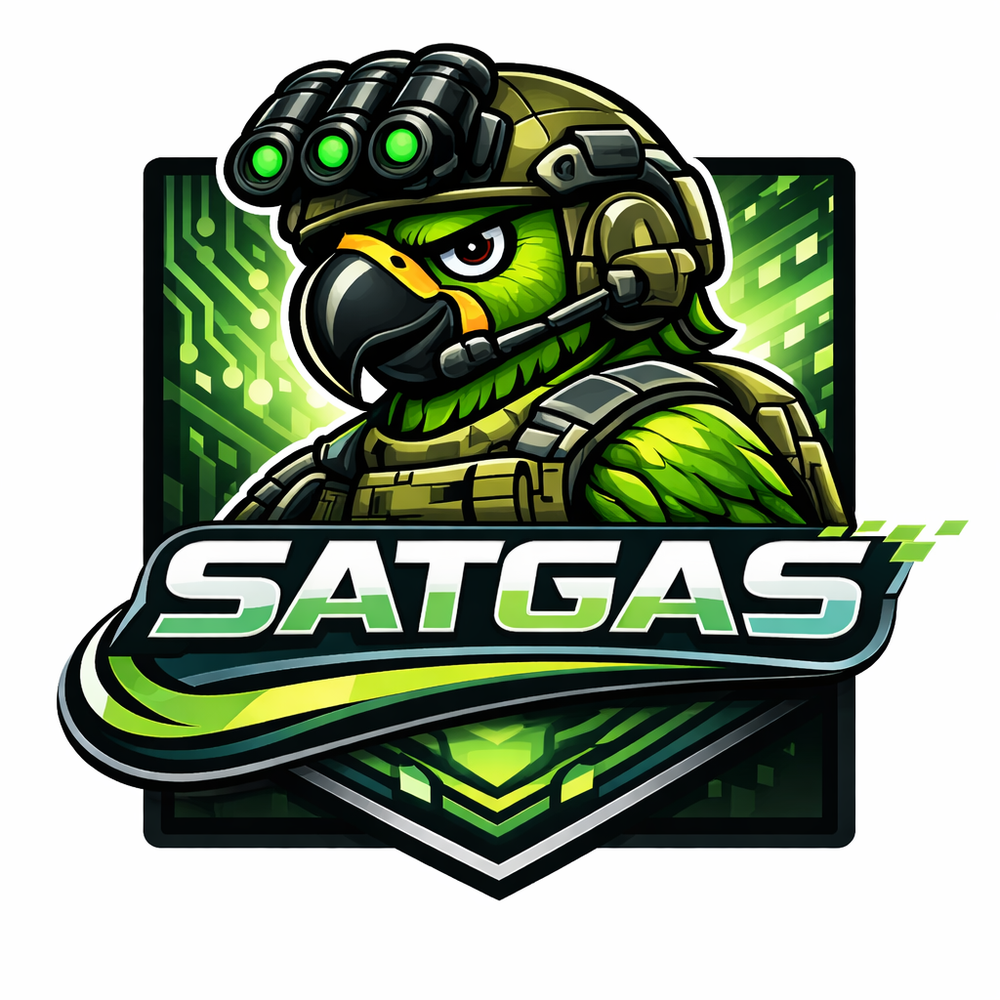
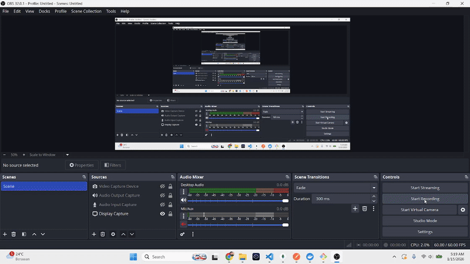

<p align="center">
  
</p>

# SATGAS

**Scalable Agent-to-agent Task Generation & Automation Service**

Generator aplikasi full-stack otomatis dengan multi-agent AI.

## Demo

<p align="center">
  
</p>

Framework ini menggunakan LangGraph untuk menggerakkan multi-agent yang berkolaborasi dalam membuat aplikasi full-stack dari prompt satu paragraf.

## Fitur Utama

- **Multi-Provider LLM**: Mendukung Qwen CLI (lokal) dan OpenAI API
- **Dynamic Tech Stack**: Otomatis menyesuaikan dengan teknologi yang diminta
- **Incremental File Saving**: File disimpan real-time saat di-generate
- **Extensible Framework**: Mudah menambah/menghapus agent
- **8 Agent Kolaboratif**: Orchestrator, Product Spec, Backend, Frontend, Test, Security, QA, DevOps
- **Parallel Execution**: Backend & Frontend berjalan bersamaan, Testing & Security & QA juga parallel

## Struktur Proyek

```
satgas/
├── src/
│   ├── agents/              # Agent modules
│   │   ├── base.py          # BaseAgent class (extend ini)
│   │   ├── registry.py      # Agent registry system
│   │   ├── orchestrator.py
│   │   ├── product_spec.py
│   │   ├── backend.py
│   │   ├── frontend.py
│   │   ├── test.py
│   │   ├── security.py
│   │   ├── qa.py
│   │   └── devops.py
│   ├── core/
│   │   ├── llm.py           # Multi-provider LLM
│   │   ├── state.py         # State definition
│   │   └── workflow.py      # Dynamic workflow
│   ├── utils/
│   │   └── helpers.py       # Utilities
│   └── app.py               # Streamlit UI
├── config/
│   └── settings.py          # Configuration
├── projects/                # Generated outputs
└── run.py
```

## Quick Start

### 1. Install Dependencies

```bash
pip install -r requirements.txt
```

### 2. Configure LLM

Copy `.env.example` ke `.env`:

```env
# Qwen CLI (default)
LLM_PROVIDER=qwen

# Atau OpenAI API
LLM_PROVIDER=openai
OPENAI_API_KEY=sk-your-key
```

### 3. Run

```bash
python run.py
```

---

## Cara Menggunakan

### Melalui Web Interface

1. **Jalankan aplikasi** dengan `python run.py`
2. **Buka browser** dan akses `http://localhost:8501`
3. **Tulis deskripsi aplikasi** yang ingin di-generate di kolom input
4. **Sebutkan tech stack** yang diinginkan (contoh: React, FastAPI, PostgreSQL)
5. **Klik Generate** dan tunggu proses selesai
6. **Hasil akan tersimpan** di folder `projects/`

### Contoh Prompt

```
Buatkan aplikasi manajemen inventaris untuk toko kelontong.
Fitur utama: login admin, CRUD produk (nama, harga, stok, kategori),
notifikasi stok rendah, laporan penjualan harian/bulanan, dan dashboard statistik.
Gunakan React untuk frontend dan FastAPI untuk backend dengan database PostgreSQL.
```

### Lokasi Output

Setelah proses selesai, aplikasi yang di-generate akan tersimpan di:

```
projects/
└── YYYYMMDD_HHMMSS_nama-proyek/
    ├── prompt.txt              # Prompt asli
    ├── docs/
    │   ├── tasks.json          # Project plan
    │   ├── spec.yaml           # Spesifikasi teknis
    │   ├── acceptance_tests.md # Acceptance criteria
    │   ├── test_plan.md        # Test plan
    │   ├── threat_model.md     # Security analysis
    │   ├── security_requirements.md
    │   ├── security_findings.json
    │   └── qa_findings.json    # QA review
    ├── backend/                # Backend source code
    ├── frontend/               # Frontend source code
    ├── docker-compose.yml      # Docker configuration
    ├── .github/
    │   └── workflows/
    │       └── ci.yml          # CI/CD pipeline
    └── docs/
        └── RUNBOOK.md          # Operations guide
```

### Tips

- Semakin detail deskripsi aplikasi, semakin baik hasilnya
- Sebutkan tech stack spesifik jika ada preferensi
- Jika tidak disebutkan, sistem akan memilih tech stack yang sesuai
- Proses generate membutuhkan waktu beberapa menit tergantung kompleksitas

---

## Developer Guide

### Arsitektur Framework

```
BaseAgent (base.py)
     |
     +-- OrchestratorAgent, BackendAgent, ...
            |
            +-- AgentRegistry (registry.py)
                    |
                    +-- Workflow (workflow.py)
                    +-- UI (app.py)
```

### Menambah Agent Baru

**Step 1: Buat file agent**

```python
# src/agents/my_agent.py

from typing import Dict, Any
from .base import BaseAgent


class MyAgent(BaseAgent):
    """Deskripsi agent."""

    # Metadata
    agent_id = "my_agent"           # ID unik
    agent_name = "My Agent"         # Nama untuk UI
    display_name = "My Agent"       # Nama untuk LLM
    step_order = 9                  # Urutan eksekusi
    description = "Deskripsi"       # Deskripsi singkat
    color = "#FF5722"               # Warna UI (hex)

    # Output: (state_key, filename, language)
    output_fields = [
        ("my_output", "my_output.json", "json"),
    ]

    # Required input dari agent sebelumnya
    required_fields = ["spec"]

    def build_prompt(self, state: Dict[str, Any]) -> str:
        """Bangun prompt untuk LLM."""
        spec = state.get("spec", "")
        return f"""Kamu adalah {self.display_name}.

TUGAS: ...

INPUT:
{spec}

{self.get_file_format_instructions()}
"""

    def process_response(self, state: Dict[str, Any], response: Any) -> Dict[str, Any]:
        """Proses response dan update state."""
        state["my_output"] = response.content
        state["status"] = "my_agent_done"
        return state
```

**Step 2: Daftarkan di registry**

```python
# src/agents/registry.py

from .my_agent import MyAgent

AGENT_CLASSES = [
    OrchestratorAgent,
    ProductSpecAgent,
    # ... existing agents ...
    MyAgent,  # Tambahkan di sini
]
```

**Step 3: Tambah state field (jika perlu)**

```python
# src/core/state.py

class AppGenerationState(TypedDict):
    # ... existing fields ...
    my_output: str  # Tambahkan field baru
```

**Step 4: Tambah file mapping (opsional)**

```python
# config/settings.py

FIELD_FILE_MAP = [
    # ... existing mappings ...
    ("my_output", "my_output.json"),
]
```

### Menghapus Agent

1. Hapus/comment import di `registry.py`
2. Hapus dari `AGENT_CLASSES` list
3. (Opsional) Hapus file agent

### Mengubah Urutan Workflow

Ubah nilai `step_order` di masing-masing agent class. Registry akan otomatis mengurutkan ulang.

### Custom Workflow (Branching)

```python
# src/core/workflow.py

from langgraph.graph import StateGraph, END
from ..agents import registry

def create_custom_workflow():
    workflow = StateGraph(AppGenerationState)

    # Add nodes
    for agent in registry.get_agents():
        workflow.add_node(agent.agent_id, agent)

    # Custom routing
    workflow.set_entry_point("orchestrator")
    workflow.add_conditional_edges(
        "orchestrator",
        decide_next_agent,  # Custom function
        {
            "simple": "devops",      # Skip to devops
            "complex": "product_spec" # Full pipeline
        }
    )
    # ... more edges

    return workflow
```

### API Reference

**BaseAgent Methods:**

| Method | Description |
|--------|-------------|
| `build_prompt(state)` | Bangun prompt untuk LLM |
| `process_response(state, response)` | Proses response LLM |
| `execute(state)` | Main execution (biasanya tidak di-override) |
| `get_file_format_instructions()` | Dapatkan format file instructions |
| `skip_execution(state, reason)` | Skip agent dengan alasan |

**Registry Methods:**

| Method | Description |
|--------|-------------|
| `get_agents()` | List semua agent terurut |
| `get_agent(id)` | Dapatkan agent by ID |
| `get_ui_configs()` | Config untuk UI |
| `get_workflow_edges()` | Edge tuples untuk workflow |

---

## Agent Pipeline

| Step | Agent | Peran | Output |
|------|-------|-------|--------|
| 1 | **Orchestrator** | Mengatur workflow dan prioritas | `tasks.json` |
| 2 | **Product Spec** | Spesifikasi teknis | `spec.yaml`, `acceptance_tests.md` |
| 3 | **Backend** | Implementasi backend | Backend files |
| 4 | **Frontend** | Implementasi UI | Frontend files |
| 5 | **Testing** | Test suites | Test files |
| 6 | **Security** | Threat modeling | Security docs |
| 7 | **QA Review** | Code review | `qa_findings.json` |
| 8 | **DevOps** | Docker, CI/CD | DevOps files |

### Workflow Modes

SATGAS mendukung dua mode workflow: **Sequential** dan **Parallel**.

#### 1. Sequential Workflow

Agent berjalan satu per satu secara berurutan:

```
Orchestrator → Product Spec → Backend → Frontend → Testing → Security → QA → DevOps
```

#### 2. Parallel Workflow (Default)

Agent yang tidak saling bergantung berjalan bersamaan untuk performa optimal:

```
            ┌─────────────┐
            │ Orchestrator │
            └──────┬──────┘
                   │
            ┌──────▼──────┐
            │ Product Spec │
            └──────┬──────┘
                   │
           ┌───────┴───────┐
           │               │
      ┌────▼────┐    ┌────▼────┐
      │ Backend │    │ Frontend │  ← Parallel
      └────┬────┘    └────┬────┘
           │               │
           └───────┬───────┘
                   │
         ┌─────────┼─────────┐
         │         │         │
    ┌────▼───┐ ┌───▼───┐ ┌───▼──┐
    │Testing │ │Security│ │  QA  │  ← Parallel
    └────┬───┘ └───┬───┘ └───┬──┘
         │         │         │
         └─────────┼─────────┘
                   │
            ┌──────▼──────┐
            │   DevOps    │
            └─────────────┘
```

| Phase | Agents | Execution | Keterangan |
|-------|--------|-----------|------------|
| 1 | Orchestrator → Product Spec | Sequential | Harus berurutan |
| 2 | Backend + Frontend | **Parallel** | Keduanya hanya butuh `spec` |
| 3 | Testing + Security + QA | **Parallel** | Ketiganya butuh `backend_code` & `frontend_code` |
| 4 | DevOps | Sequential | Menunggu semua selesai |

#### Mengganti Workflow Mode

Edit `src/core/workflow.py`:

```python
# Parallel (default) - lebih cepat
app = create_parallel_workflow().compile()

# Sequential - lebih sederhana
# app = create_workflow().compile()
```

#### Debug Workflow

```python
from src.core.workflow import print_workflow, print_parallel_workflow

print_workflow()           # Lihat struktur sequential
print_parallel_workflow()  # Lihat struktur parallel
```

## Tech Stack yang Didukung

| Backend | Frontend | Database |
|---------|----------|----------|
| Express.js | React | PostgreSQL |
| FastAPI | Vue.js | MySQL |
| Django | Angular | MongoDB |
| Laravel | Svelte | SQLite |
| Gin (Go) | Next.js | Redis |
| Rails | Nuxt | MariaDB |
| Spring Boot | Blade | Cassandra |
| Flask | EJS | Elasticsearch |
| NestJS | Thymeleaf | |
| Hapi.js | | |
| Koa.js | | |

### Menambah Tech Stack Baru

Tech stack dikonfigurasi di `config/settings.py`. Untuk menambah tech stack baru:

**Step 1: Tambah di BACKEND_STACKS (untuk backend framework)**

```python
# config/settings.py

BACKEND_STACKS = {
    # ... existing stacks ...
    "my_framework": {
        "name": "My Framework",
        "language": "python",
        "docker_image": "python:slim",
        "structure": [
            "backend/requirements.txt",
            "backend/app/main.py",
            "backend/app/routes/",
        ],
        "commands": {
            "install": "pip install -r requirements.txt",
            "test": "pytest",
            "build": "echo 'No build step'",
            "start": "python app/main.py",
        },
    },
}
```

**Step 2: Tambah di FRONTEND_STACKS (untuk frontend framework)**

```python
FRONTEND_STACKS = {
    # ... existing stacks ...
    "my_frontend": {
        "name": "My Frontend",
        "language": "javascript",
        "docker_image": "node:alpine",
        "structure": [
            "frontend/package.json",
            "frontend/src/index.js",
            "frontend/src/components/",
        ],
        "commands": {
            "install": "npm install",
            "test": "npm test",
            "build": "npm run build",
            "start": "npm start",
        },
    },
}
```

**Step 3: Tambah di DATABASE_STACKS (untuk database)**

```python
DATABASE_STACKS = {
    # ... existing stacks ...
    "my_database": {
        "name": "My Database",
        "docker_image": "my-db:latest",
        "default_port": 5000,
        "env_vars": {
            "DB_USER": "${DB_USER:-admin}",
            "DB_PASSWORD": "${DB_PASSWORD:-admin}",
        },
    },
}
```

**Format Konfigurasi:**

| Field | Deskripsi |
|-------|-----------|
| `name` | Nama untuk display |
| `language` | Bahasa pemrograman |
| `docker_image` | Base image Docker |
| `structure` | List file/folder yang di-generate |
| `commands` | Commands untuk install, test, build, start |
| `default_port` | Port default (database) |
| `env_vars` | Environment variables (database) |

### Helper Functions

```python
from config.settings import (
    get_backend_names,      # List nama backend
    get_frontend_names,     # List nama frontend
    get_database_names,     # List nama database
    get_backend_by_keyword, # Cari backend by keyword
    format_tech_stack_list, # Format untuk prompt
)
```

## Output

```
projects/
└── YYYYMMDD_HHMMSS_project-name/
    ├── prompt.txt
    ├── docs/
    │   ├── tasks.json
    │   ├── spec.yaml
    │   └── ...
    ├── backend/
    ├── frontend/
    ├── docker-compose.yml
    └── .github/workflows/ci.yml
```

## Author

Created with all emotion by **[Fauzi Fadhlurrohman](https://www.linkedin.com/in/fauzi-fadhlurrohman)**

## License

MIT License
